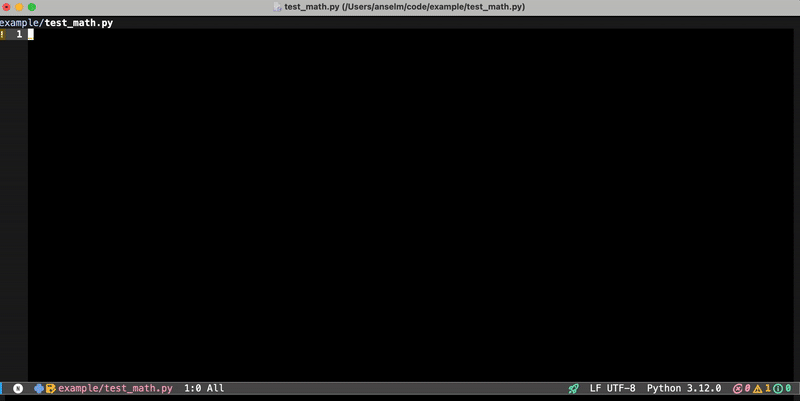

<p align="center">
    
</p>

# le-gpt.el
[](https://melpa.org/#/le-gpt)

le-gpt.el is a comprehensive Emacs package for interacting with large language models from OpenAI, Anthropic, and Deepseek. It's a feature-rich fork of [gpt.el](https://github.com/stuhlmueller/gpt.el) that adds project awareness, completion, region transform, and more to come.

The aim is to make sure Emacs stays up-to-date with modern GPT support, essentially aiming for a CursorAI for Emacs.

## Changelog

  - 0.12.0: Add pending context queue for ad-hoc snippets
  - 0.11.0: Add system prompt snippets for reusable instructions
  - 0.10.0: Update model list (latest claude & gpt)
  - 0.9.0: 
    - Performance improvements for selecting context in large projects
    - Fix context history being in reversed order
    - Deduplicate context history
  - 0.8.0: Add support to interrupt gpt process (`le-gpt-interrupt`)
  - 0.7.0: Update model list to include GPT-5 family & make it configurable.
  - 0.6.0: Add support for filtering buffer list via regex on content. Add optional `le-gpt-consult-buffers` function.
  - 0.5.0: Add buffers as context; remove global context file support.
  - 0.4.0: Add DeepSeek support

## Features

- **Chat Interface**: Create and manage multiple chat sessions with GPT. Use `M-x le-gpt-chat` to start a session. See [usage](#chat-interface) for more details. 

- **Chat Buffer List**: Display a list of all GPT chat buffers with `M-x le-gpt-list-buffers`. 
This feature allows you to manage and navigate through your chat buffers efficiently.
See [usage](#buffer-list) for more details.

- **Completion at Point**: Let GPT complete what you're currently writing. Use `M-x le-gpt-complete-at-point` to get suggestions based on your current cursor position. See [usage](#completion-at-point) for more details.

- **Region Transformation**: Select a region you want GPT to transform. Use `M-x le-gpt-transform-region` to transform the selected region using GPT. See [usage](#region-transformation) for more details.

- **Context with Caching**: Select files from your project and buffers that GPT should use as context.
You can select per-command context by running the above commands with a prefix argument (`C-u`). Context is used by chat, completion, and region transforms. See [usage](#context) for more details.

- **Pending Context Queue**: Quickly grab text snippets from any buffer (logs, errors, code fragments) and queue them for the next GPT request. No need to copy-paste into your prompt. See [usage](#pending-context) for more details.

- **System Prompt Snippets**: Create reusable system prompt snippets (e.g., "Be concise", "You are a code reviewer") that can be toggled on/off and automatically combined when making GPT requests. See [usage](#system-prompt-snippets) for more details.

### Mandatory GIFs

| Chat Interface                                                                   | Completion at point                                                        |
|----------------------------------------------------------------------------------|----------------------------------------------------------------------------|
|                                  |  |


| Context                                                                               | Region Transformation                                             |
|-----------------------------------------------------------------------------------------------|-------------------------------------------------------------------|
|                            |  |

...and a screenshot for a small buffer list for completeness


## Installation

### Prerequisites

You'll need Python packages for the API clients:

```bash
pip install openai anthropic jsonlines
```
You don't need to install all of them, but minimally `openai` or `anthropic`.
For `deepseek` you'll need `openai`.

You'll also need API keys from [OpenAI](https://beta.openai.com/) and/or [Anthropic](https://console.anthropic.com) and/or [Deepseek](https://platform.deepseek.com/api_keys).

You'll also need [markdown-mode](https://github.com/jrblevin/markdown-mode) for displaying the chat conversations nicely.

### Using Melpa
`le-gpt` is available via [MELPA](https://melpa.org/). 

Here's how to install it with [straight](https://github.com/radian-software/straight.el):

```elisp
(use-package le-gpt
  :after evil
  ;; suggested keybindings
  :bind (("M-C-g" . le-gpt-chat)
         ("M-C-n" . le-gpt-complete-at-point)
         ("M-C-t" . le-gpt-transform-region)
         ("M-C-k" . le-gpt-interrupt)
         ("M-C-c" . le-gpt-context-add-region)
         ;; if you use consult
         ("C-c C-s" . le-gpt-consult-buffers))
  :config
  ;; set default values as you wish (and swith with `le-gpt-switch-model`)
  (setq le-gpt-api-type 'anthropic)
  (setq le-gpt-model "claude-sonnet-4-5")
  (setq le-gpt-max-tokens 10000)
  
  
  ;; Performance settings for large projects (optional)
  (setq le-gpt-max-file-size (* 500 1024))           ; 500KB max per file
  (setq le-gpt-max-total-context-size (* 5 1024 1024)) ; 5MB total context limit
  (setq le-gpt-file-preview-lines 1000)              ; Show first 1000 lines of large files

  
  (setq le-gpt-openai-key "xxx")
  (setq le-gpt-anthropic-key "xxx")
  (setq le-gpt-deepseek-key "xxx"))
```

If you're using `evil`, you'll want to add

``` elisp
(with-eval-after-load 'evil
    (evil-define-key 'normal le-gpt-buffer-list-mode-map
      (kbd "RET") #'le-gpt-buffer-list-open-buffer
      (kbd "d") #'le-gpt-buffer-list-mark-delete
      (kbd "u") #'le-gpt-buffer-list-unmark
      (kbd "x") #'le-gpt-buffer-list-execute
      (kbd "gr") #'le-gpt-buffer-list-refresh
      (kbd "/") #'le-gpt-buffer-list-filter
      (kbd "C-c C-s") #'le-gpt-consult-buffers
      (kbd "q") #'quit-window)
    (evil-define-key 'normal le-gpt-snippets-list-mode-map
      (kbd "RET") #'le-gpt-snippets-list--edit
      (kbd "a") #'le-gpt-snippets-list--add
      (kbd "d") #'le-gpt-snippets-list--delete
      (kbd "t") #'le-gpt-snippets-list--toggle
      (kbd "+") #'le-gpt-snippets-list--decrease-order
      (kbd "-") #'le-gpt-snippets-list--increase-order
      (kbd "gr") #'le-gpt-snippets--refresh
      (kbd "q") #'quit-window))
```

to get the above mentioned buffer list and snippet list commands to work.

## Configuration

See all available customizations via `M-x customize-group RET le-gpt`.

Basic configuration:
```elisp
;; API Keys
(setq le-gpt-openai-key "sk-...")
(setq le-gpt-anthropic-key "sk-ant-...")
(setq le-gpt-deepseek-key "sk-...")

;; Model Parameters (optional)
(setq le-gpt-api-type 'anthropic)
(setq le-gpt-model "claude-sonnet-4-5") ;; make sure this matches le-gpt-api-type
(setq le-gpt-max-tokens 10000)
(setq le-gpt-temperature 0)

;; Performance settings for large projects (optional)
(setq le-gpt-max-file-size (* 500 1024))           ; 500KB max per file
(setq le-gpt-max-total-context-size (* 5 1024 1024)) ; 5MB total context limit
(setq le-gpt-file-preview-lines 50)                ; Show first 50 lines of files
```

### Performance Settings

- `le-gpt-max-file-size`: Maximum size of individual files to include in context (default: 1MB)
- `le-gpt-max-total-context-size`: Maximum total size of all context files combined (default: 10MB)  
- `le-gpt-file-preview-lines`: For large files, show only the first N lines (0 = show all, default: 1000)


## Usage

### Context
You can add context for all of the below functionality by calling the functions with a prefix argument (`C-u`).
You'll then be prompted to add project files and buffers as context.
For convenience, you also have the option to use a previous context selection.

### Pending Context

Pending context lets you quickly grab snippets from any buffer and queue them for the next GPT request. This is useful for including error logs, test output, or code fragments without copy-pasting.

#### Workflow
1. Select text in any buffer (e.g., error logs in a shell buffer)
2. Run `M-x le-gpt-context-add-region` (suggested binding: `M-C-c`)
3. Repeat for additional snippets if needed
4. Run your GPT command (`le-gpt-chat`, `le-gpt-complete-at-point`, etc.)
5. Pending context is automatically included and then cleared

#### Commands
- `M-x le-gpt-context-add-region`: Add selected region to pending context
- `M-x le-gpt-context-clear`: Clear all pending context
- `M-x le-gpt-context-show`: Show current pending context in a buffer

Pending context is session-only (not persisted) and is automatically cleared after being used in a GPT request.

### Chat Interface

Start a chat session:
```elisp
M-x le-gpt-chat
```

Key bindings in chat buffers include:
  - `C-c C-c`: Send follow-up command
  - `C-c C-p`: Toggle prefix visibility
  - `C-c C-b`: Copy code block at point
  - `C-c C-t`: Generate descriptive buffer name from its content
  - `C-c C-s`: Save the current buffer
  - `C-c C-k`: Interrupt the current process

### Buffer List

Display a list of all GPT buffers (created via `le-gpt-chat`):
```elisp
M-x le-gpt-list-buffers
```

#### Filtering the list
You can narrow down the list by regex'ing over the content pressing `/` followed by your regex.
To reset the filter, hit `C-c C-r`.

#### Executing commands
Mark buffers you want to delete with `d`. Execute those deletions with `x`. Unmark with `u`.
You can visit a buffer in the list by hitting `RET` and refresh the list with `g r`.

#### Generating buffer names
Generating buffer names with gpt via `C-c C-t` also works in the buffer list.

#### Saving & loading buffers
Save a chat when visiting a buffer (or in the buffer list) with `C-c C-s` (or `M-x le-gpt-chat-save-buffer` and `M-x le-gpt-buffer-list-save-buffer`, respectively).
You can load previously saved chats with `M-x le-gpt-chat-load-file`. 


### Completion at Point

Get completions based on your current cursor position:
```elisp
M-x le-gpt-complete-at-point
```

### Region Transformation

Transform selection via:
```elisp
M-x le-gpt-transform-region
```

### Switching between models
As mentioned above, you can set the model + provider like so:

``` elisp
  (setq le-gpt-api-type 'anthropic)
  (setq le-gpt-model "claude-sonnet-4-5")
```

For convenience, you can also cycle through different models via `le-gpt-switch-model`.
You can update the underyling model list by customizing `le-gpt-model-list`.

### Interrupt process
For long(er) running responses that are going in the wrong direction, you may want to interrupt them.
You can do that in a chat using `C-c C-k` and otherwise with `le-gpt-interrupt`.

### System Prompt Snippets

System prompt snippets allow you to create reusable instructions that are automatically included in requests to GPT. This is useful for persistent preferences like "Be concise", "Don't add unnecessary comments", or role-based instructions like "You are an expert code reviewer".

#### Managing Snippets

Open the snippet management interface:
```elisp
M-x le-gpt-snippet-list
```

Key bindings in the snippet list:
- `a`: Add a new snippet
- `RET`: Edit snippet content
- `t`: Toggle snippet enabled/disabled
- `d`: Delete snippet
- `+`/`-`: Adjust priority (lower order = higher priority)
- `g`: Refresh list

You can also manage snippets directly:
- `M-x le-gpt-snippet-add`: Add a new snippet
- `M-x le-gpt-snippet-edit`: Edit an existing snippet
- `M-x le-gpt-snippet-toggle`: Toggle a snippet on/off
- `M-x le-gpt-snippet-remove`: Remove a snippet

#### How Snippets Work

- Enabled snippets are automatically prepended to the system prompt for all GPT requests (chat, completion, transform)
- Multiple enabled snippets are concatenated in order (by the `:order` field)
- Snippets are persisted to `~/.emacs.d/le-gpt-snippets.el` (configurable via `le-gpt-snippets-file`)
- Changes are saved automatically

#### Example Snippets

Here are some useful snippet ideas:
- "Be concise and direct. Avoid unnecessary explanations."
- "When writing code, don't add comments unless the logic is non-obvious."
- "You are an expert Emacs Lisp developer."
- "Always consider edge cases and error handling."

## Contributing

Contributions are welcome! Please feel free to submit issues and pull requests on GitHub.

Some things I'm planning to work on:

- [x] Ability to easily add/remove system prompt snippets (e.g., "Don't be a sycophant", "Be brief")
- [x] Adding snippets to context (instead of entire files or copy pasting in prompt)
- [ ] Gemini support
- [ ] MCP support

## License

le-gpt.el is licensed under the MIT License. See [LICENSE](LICENSE) for details.


